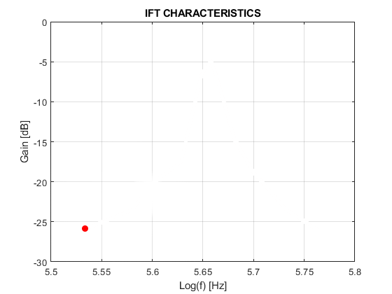
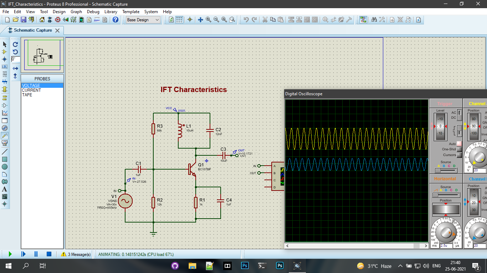

# IFT Characteristics

# 

## Proteus - Circuit Diagram

## ✏️ Procedure :

- **Open Proteus software & implement the circuit as per above diagram.**

- **Give a constant voltage Sinewave as the Input Signal.**

- **The Output Voltage of IFT circuit will be max. at 455KHz (Resonance Frequency).**

- **Vary the Input Voltage's frequency to and fro from 455KHz & note down the Output Voltage from Digital Oscilloscope.**

- **Tabulate the above readings, (you can use MS Excel / Google Spreadsheet) etc... as you wish.**

- **To plot the above values, (here I used MATLAB, you can also plot on graph paper too).**

- **The log of frequencies were found.**

- **The Gain in dB is found out by the formula:** 
  $$
  Gain = 20 * log ( Vo / Vin )
  $$

- **Finally the graph Log( f ) vs Gain in dB is plotted.**

  

## <u>☕ Buy Me A Coffee :</u>

**Visit 👉 https://www.linkedin.com/in/albinjosephcr/**

